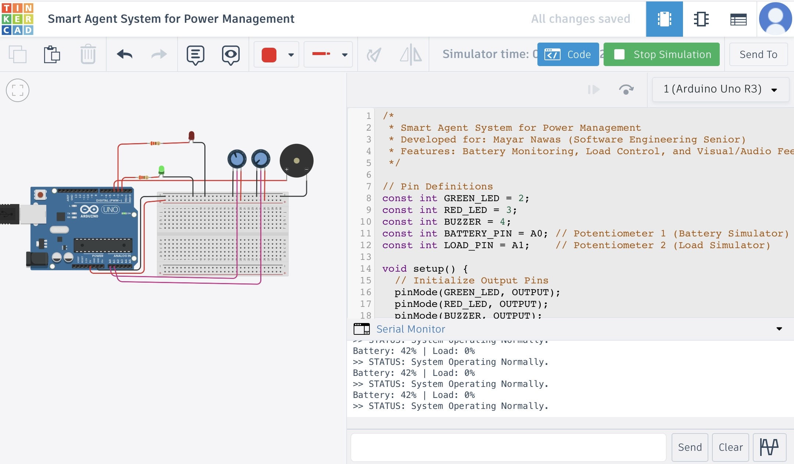
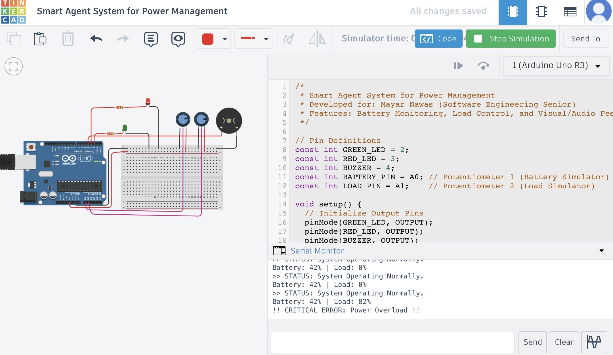
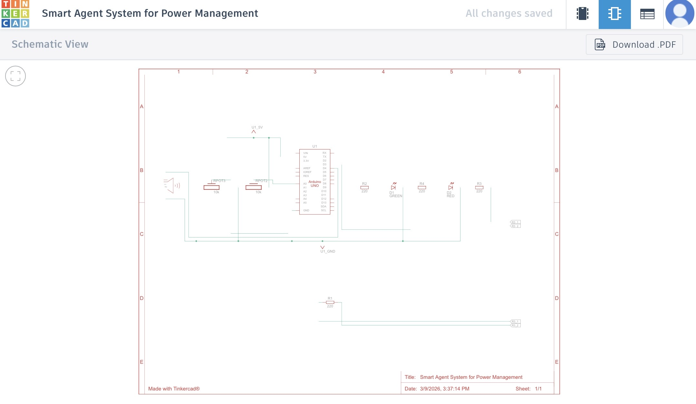

# Smart Inverter Guardian Agent 🔋🤖

**Developed by:** Mayar Waleed Nawas  
* Software Engineering Student *

---

## 🌟 The Problem Statement
Traditional inverters often struggle with low battery or high loads, leading to:
1. **Annoying Noise:** Constant, stressful buzzing for the user.
2. **Battery Degradation:** Deep discharge significantly reduces battery lifespan.
3. **Hardware Risks:** Frequent sudden disconnections can damage sensitive appliances.
4. **Inverter Wear:** Repeated alarm triggers can lead to internal circuit failure.

**Our Solution:** An Intelligent Agent that acts **rationally** and **proactively** to manage power before critical failures happen.

---

## 🧠 Agent Architecture

### 1. Agent Type: Simple Reflex Agent
The system operates as a **Simple Reflex Agent**. It doesn't require a complex memory (Internal State); it maps current **Percepts** directly to **Actions** using a set of "If-Then" rules. This ensures high-speed response and reliability in power management.

### 2. PEAS Description
| Component | Description |
| :--- | :--- |
| **Performance Measure** | Zero annoying noise, 100% battery protection, proactive user alerting. |
| **Environment** | Virtual simulation of Inverter, Battery, and connected Appliances. |
| **Actuators** | Green LED (Status), Red LED (Alert), Piezo Buzzer (Audio warning/Voice). |
| **Sensors** | Potentiometer A0 (Battery Monitor), Potentiometer A1 (Load/Consumption Monitor). |

### 3. PAGE Model
* **Percepts:** Power consumption percentage, Battery voltage/charge level.
* **Actions:** Activate/Deactivate LEDs, Trigger alarms, Proactive Load-Shedding.
* **Goals:** Prevent battery damage, protect appliances, eliminate noise pollution.
* **Environment:** Smart power management context.

---

## 🛠️ Bill of Materials (Components & Values)

### Microcontroller
* **Arduino Uno R3:** The "Brain" of the Agent that executes the logic.

### Sensors (Inputs)
* **Potentiometer 1 (10kΩ) @ Pin A0:** Represents **Battery Charge Level**.
    * *0%:* Empty/Critical.
    * *100%:* Fully Charged.
* **Potentiometer 2 (10kΩ) @ Pin A1:** Represents **Load/Inverter Consumption**.
    * *High Value (>80%):* Represents an "Overload" scenario.

### Actuators (Outputs)
* **Green LED (Pin 2):** Indicates **System Stable** (Safe to use).
* **Red LED (Pin 3):** Indicates **Critical State** (Low Battery or Overload).
* **Piezo Buzzer (Pin 4):** Simulates **Voice/Audio Alerts** (High tone for Overload, Beep for Low Battery).

### Protection
* **Fixed Resistors (220Ω):** Current limiting for LED safety.

---

## 📝 System Logic
1. **Stable State:** `Battery > 20%` AND `Load < 80%` → **Green LED ON**.
2. **Low Battery:** `Battery < 20%` → **Red LED ON + Beeping Sound**.
3. **Overload:** `Load > 80%` → **Red LED ON + Continuous Alarm**.
4. **Proactive Intervention:** If Overload persists for 1 second, the Agent automatically "cuts the load" (stops the alarm) to prevent damage.

---

## 📸 Project Gallery

### 1. Circuit Schematic


### 2. Wiring & Simulation




---

## ☀️ Practical Scenario
* **Morning (Sunny):** Solar panels are charging the battery. Potentiometer A0 is high. The Agent shows a **Green Light** (Safe to use appliances).
* **Cloudy/Evening:** Power drops suddenly. Potentiometer A0 falls below 20%. Instead of the Inverter failing, the Agent triggers a **Red Light** and an **Audio Message** saying: "Low Battery! Please disconnect non-essential devices" to save the battery life.

---

## 🚀 How to Run
You can test the simulation directly via Tinkercad:
[👉 Click here to run the Simulation](https://www.tinkercad.com/things/hfsY1rU2YPc/editel?returnTo=%2Fdashboard)

---

## 💻 The Code
```cpp
/*
 * Smart Agent System for Power Management
 * Developed for: Mayar Nawas (Software Engineering Senior)
 */

const int GREEN_LED = 2;
const int RED_LED = 3;
const int BUZZER = 4;
const int BATTERY_PIN = A0; 
const int LOAD_PIN = A1;    

void setup() {
  pinMode(GREEN_LED, OUTPUT);
  pinMode(RED_LED, OUTPUT);
  pinMode(BUZZER, OUTPUT);
  Serial.begin(9600);
  
  // Self-test
  digitalWrite(GREEN_LED, HIGH);
  digitalWrite(RED_LED, HIGH);
  delay(500);
  digitalWrite(GREEN_LED, LOW);
  digitalWrite(RED_LED, LOW);
}

void loop() {
  int batteryLevel = map(analogRead(BATTERY_PIN), 0, 1023, 0, 100);
  int loadLevel = map(analogRead(LOAD_PIN), 0, 1023, 0, 100);

  if (loadLevel > 80) {
    digitalWrite(GREEN_LED, LOW);
    digitalWrite(RED_LED, HIGH);
    tone(BUZZER, 1000); 
    Serial.println("!! CRITICAL: Power Overload !!");
    delay(1000); 
    noTone(BUZZER);
    Serial.println(">> AGENT: Load Shedding Active.");
    digitalWrite(RED_LED, LOW);
    delay(2000);
  } else if (batteryLevel < 20) {
    digitalWrite(GREEN_LED, LOW);
    digitalWrite(RED_LED, HIGH);
    tone(BUZZER, 500); 
    delay(200);
    noTone(BUZZER);
    Serial.println("?? WARNING: Low Battery ??");
  } else {
    digitalWrite(GREEN_LED, HIGH);
    digitalWrite(RED_LED, LOW);
    noTone(BUZZER);
    Serial.println(">> STATUS: System Stable.");
  }
  delay(200);
}
